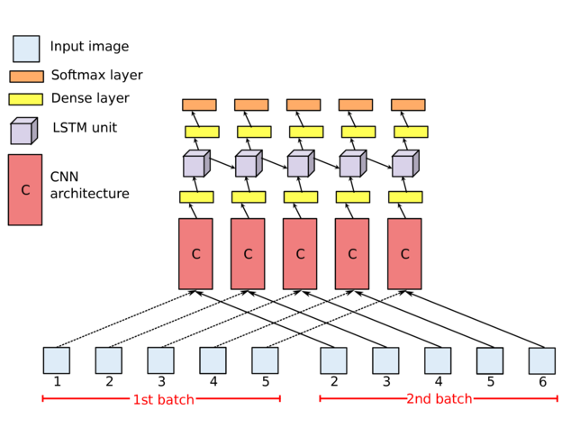
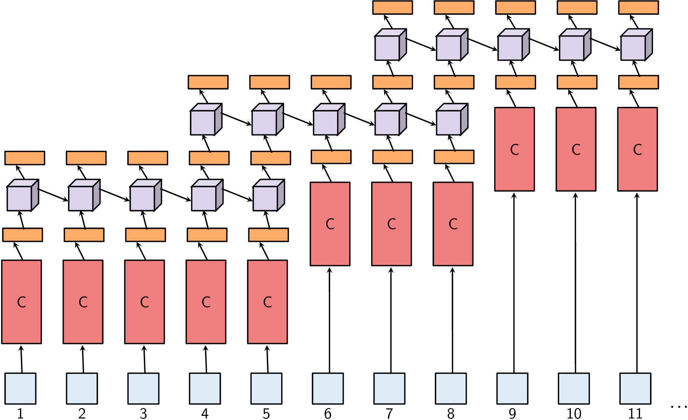

# Batch-Based Activity Recognition From Egocentric Photo-Streams

### Introduction

This repository contains the code used in the paper [Batch-Based Activity Recognition From Egocentric Photo-Streams](http://openaccess.thecvf.com/content_ICCV_2017_workshops/papers/w34/However_alejandro.cartasub.edu_mariella.dimiccolicvc.uab.es_radevapgmail.com_ICCV_2017_paper.pdf) originally presented at the [EPIC workshop](http://www.eyewear-computing.org/EPIC_ICCV17/) @ [ICCV 2017](http://iccv2017.thecvf.com/)

<table border="0">
  <tr>
    <td></img></td>
    <td></img></td>
  </tr>
</table>

If you use this code, please consider citing:

      @InProceedings{Cartas_2017_ICCV,
         author = {Cartas, Alejandro and Dimiccoli, Mariella and Radeva, Petia},
         title = {Batch-Based Activity Recognition From Egocentric Photo-Streams},
         booktitle = {The IEEE International Conference on Computer Vision (ICCV) Workshops},
         month = {Oct},
         year = {2017}
      }

### Contents

1. [Installation](#installation)
2. [Usage](#usage)
3. [Downloads](#downloads)

### Installation

1. Clone this repository
  	```Shell
  	git clone --recursive https://github.com/gorayni/iccv_epic_2017.git

2. Download the NTCIR-12 dataset at http://ntcir-lifelog.computing.dcu.ie/NTCIR12/.

3. Create a symbolic link datasets/ntcir/images pointing to NTCIR_Lifelog_formal_run_Dataset/NTCIR-Lifelog_formal_run_images.

4. Split the data by executing the *Creating data splits for VGG-16 training* notebook. This will create the cross-validation splits in the directory *data*.

### Training

Training the VGG-16+LSTM:

```bash
timestep=5
./run_training_vgg16+lstm.sh $timestep
```

### Downloads

1. VGG-16 [[weights]](https://drive.google.com/file/d/1eBlqGGaXKopDltBu6y9ZjtxGLafqJk9m/view?usp=sharing)
2. VGG-16+LSTM [[Timestep 5]](https://drive.google.com/open?id=1ZiGfB8aIad2wl3OxkDJogBYuZnaHxShE) [[Timestep 10]](https://drive.google.com/open?id=1q0TMgWt9C3AlKl9pzL5NDIJandtXnJfI)